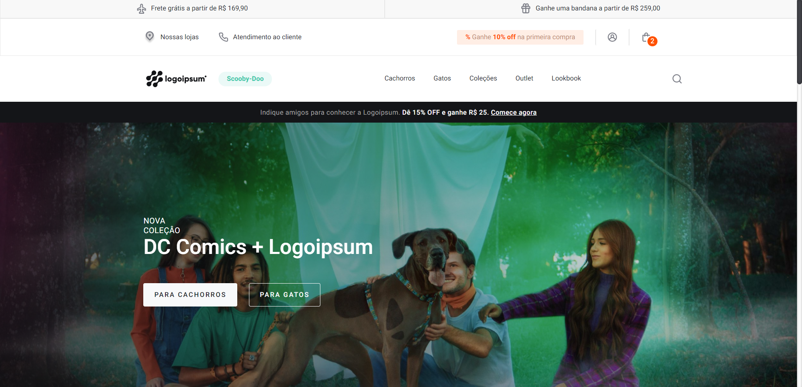
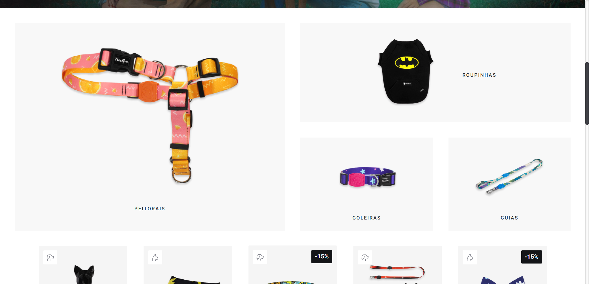

  

  <h3 align="center">front-end-test</h3>

  

    Front-end test
     
    <a href="https://github.com/viniciusgugelmin/front-end-test"><strong>Explore the docs »</strong></a>
    <!--
    <a href="https://github.com/viniciusgugelmin/front-end-test">View Demo</a>
    ·
    -->
  

  
<h2 style="display: inline-block">Abstract</h2>

  <ol>
    <li>
      <a href="#about-the-project">About The Project</a>
    </li>
    <li><a href="#contact">Contact</a></li>
  </ol>

## About The Project
Front end test - Web Development

- HTML and CSS
- Time: 06:55:21 
 

## Contact

Vinícius Kruchelski Gugelmin - vinigugelmin@gmail.com

Project Link: [https://github.com/viniciusgugelmin/front-end-test](https://github.com/viniciusgugelmin/front-end-test)
